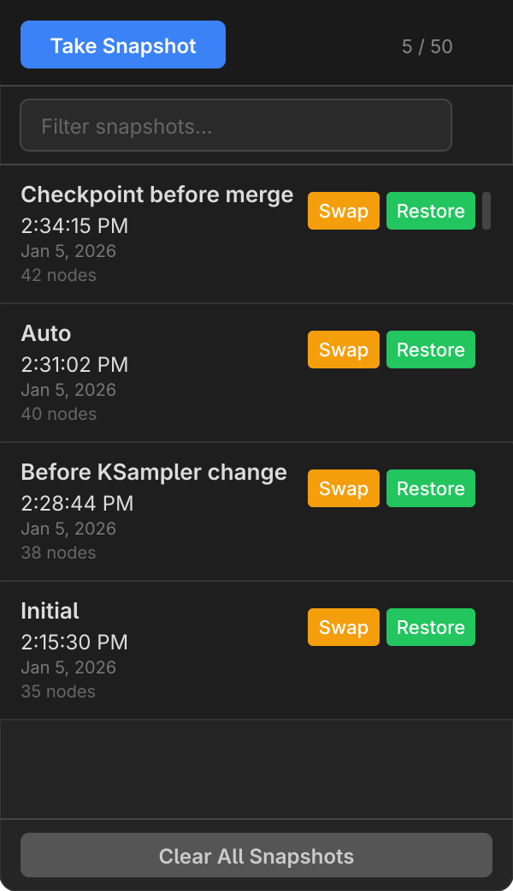
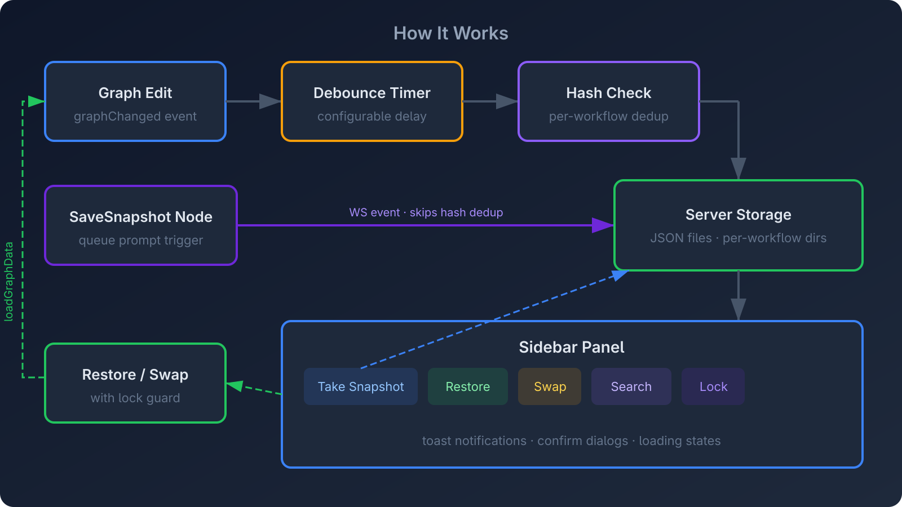

<p align="center">
  
</p>

<p align="center">
  <a href="https://registry.comfy.org/publishers/ethanfel/nodes/comfyui-snapshot-manager"></a>
  <a href="LICENSE"></a>
  
  
</p>

---

**Workflow Snapshot Manager** automatically captures your ComfyUI workflow as you edit. Browse, name, search, and restore any previous version from a sidebar panel — all stored locally in your browser's IndexedDB.

<p align="center">
  
</p>

## Features

- **Auto-capture** — Snapshots are saved automatically as you edit, with configurable debounce
- **Custom naming** — Name your snapshots when taking them manually ("Before merge", "Working v2", etc.)
- **Search & filter** — Quickly find snapshots by name with the filter bar
- **Restore or Swap** — Open a snapshot as a new workflow, or replace the current one in-place
- **Workflow browser** — Browse and recover snapshots from any workflow, including renamed or deleted ones
- **Per-workflow storage** — Each workflow has its own independent snapshot history
- **Theme-aware UI** — Adapts to light and dark ComfyUI themes
- **Toast notifications** — Visual feedback for save, restore, and error operations
- **Lock/pin snapshots** — Protect important snapshots from auto-pruning and "Clear All" with a single click
- **Concurrency-safe** — Lock guard prevents double-click issues during restore
- **Zero backend** — Pure frontend extension, no server dependencies

## Installation

### ComfyUI Manager (Recommended)

Search for **Workflow Snapshot Manager** in [ComfyUI Manager](https://github.com/ltdrdata/ComfyUI-Manager) and click Install.

### Git Clone

```bash
cd ComfyUI/custom_nodes
git clone https://github.com/ethanfel/Comfyui-Workflow-Snapshot-Manager.git
```

Restart ComfyUI after installing.

## Usage

### 1. Open the Sidebar

Click the **clock icon** () in the ComfyUI sidebar to open the Snapshots panel.

### 2. Snapshots are Captured Automatically

As you edit your workflow, snapshots are saved automatically after a configurable delay (default: 3 seconds). An initial snapshot is also captured when the workflow loads.

### 3. Take a Named Snapshot

Click **Take Snapshot** to manually save the current state. A prompt lets you enter a custom name — great for checkpoints like "Before refactor" or "Working config".

### 4. Search & Filter

Use the filter bar at the top of the panel to search snapshots by name. The clear button (**&times;**) resets the filter.

### 5. Restore or Swap

Each snapshot has action buttons:

| Button | Action |
|--------|--------|
| **Lock** | Toggles lock protection (padlock icon) |
| **Swap** | Replaces the current workflow in-place (same tab) |
| **Restore** | Opens the snapshot as a new workflow |

### 6. Lock / Pin Snapshots

Click the **padlock icon** on any snapshot to lock it. Locked snapshots are protected from:

- **Auto-pruning** — When the snapshot count exceeds the max, only unlocked snapshots are pruned
- **Clear All** — Locked snapshots survive bulk deletion (the toast reports how many were kept)

To unlock, click the padlock again. Deleting a locked snapshot individually is still possible but requires confirmation.

### 7. Browse Other Workflows

Click the **workflow name** below the header to expand the workflow picker. It lists every workflow that has snapshots in the database, with counts. Click any workflow to view its snapshots — an amber banner confirms you're viewing a different workflow, and "Take Snapshot" is disabled to avoid confusion. Click **Back to current** to return.

This is especially useful for recovering snapshots from workflows that were renamed or deleted.

### 8. Delete & Clear

- Click **&times;** on any snapshot to delete it individually (locked snapshots prompt for confirmation)
- Click **Clear All Snapshots** in the footer to remove all unlocked snapshots for the current workflow (locked snapshots are preserved)

## Settings

All settings are available in **ComfyUI Settings > Snapshot Manager > Capture Settings**:

| Setting | Type | Default | Description |
|---------|------|---------|-------------|
| **Auto-capture on edit** | Toggle | `On` | Automatically save snapshots when the workflow changes |
| **Capture delay** | Slider | `3s` | Seconds to wait after the last edit before auto-capturing (1–30s) |
| **Max snapshots per workflow** | Slider | `50` | Maximum number of unlocked snapshots kept per workflow (5–200). Oldest unlocked are pruned automatically; locked snapshots are never pruned |
| **Capture on workflow load** | Toggle | `On` | Save an "Initial" snapshot when a workflow is first loaded |

## Architecture

<p align="center">
  
</p>

**Data flow:**

1. **Graph edits** trigger a `graphChanged` event
2. A **debounce timer** prevents excessive writes
3. The workflow is serialized and **hash-checked** against the last capture (per-workflow) to avoid duplicates
4. New snapshots are written to **IndexedDB** (browser-local, persistent)
5. The **sidebar panel** reads from IndexedDB and renders the snapshot list
6. **Restore/Swap** loads graph data back into ComfyUI with a lock guard to prevent concurrent operations

**Storage:** All data stays in your browser's IndexedDB — nothing is sent to any server. Snapshots persist across browser sessions and ComfyUI restarts.

## FAQ

**Where are snapshots stored?**
In your browser's IndexedDB under the database `ComfySnapshotManager`. They persist across sessions but are browser-local (not synced between devices).

**Will this slow down ComfyUI?**
No. Snapshots are captured asynchronously after a debounce delay. The hash check prevents redundant writes.

**What happens if I switch workflows?**
Each workflow has its own snapshot history. Switching workflows cancels any pending captures and shows the correct snapshot list. You can also browse snapshots from other workflows using the workflow picker.

**I renamed/deleted a workflow — are my snapshots gone?**
No. Snapshots are keyed by the workflow name at capture time. Use the workflow picker to find and restore them under the old name.

**Can I use this with ComfyUI Manager?**
Yes — install via ComfyUI Manager or clone the repo into `custom_nodes/`.

## License

[MIT](LICENSE)
